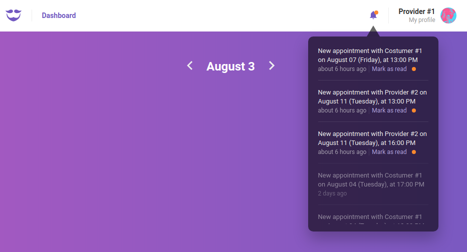

<h1 align="center">
    
    <br/
    >
    💈 GoBarber
</h1>

<h4 align="center">
A fictional web application for barbers developed during the GoStack bootcamp.
</h4>

<p align="center">
  <a href="#-project">Project</a>&nbsp;&nbsp;&nbsp;|&nbsp;&nbsp;&nbsp;
  <a href="#-tools">Tools</a>&nbsp;&nbsp;&nbsp;|&nbsp;&nbsp;&nbsp;
  <a href="#-back-end">Back-end</a>&nbsp;&nbsp;&nbsp;|&nbsp;&nbsp;&nbsp;
  <a href="#-running-locally">Running locally</a>
</p>

<p align="center">
  
  
</p>

# 💻 Project

GoBarber is a project/challenge developed with the intent of diving into React, Redux, and pretty much all the tools that provide the underlying structure for such an application, such as Node.js, Express, PostgreSQL, Docker, request handling (and HTTP status codes), middlewares, seeds and migrations, JWT authentication, queues and background jobs, file uploading (albeit locally), linting and debugging tools, mail delivery systems, etc.

The application allows customers to book appointments with barbers, which work within a limited range of available hours; this alone illustrates some of the many business rules that needed to be transposed into code.

<table>
    <thead>
        <tr>
          <th>Sign in</th>
          <th>Dashboard</th>
          <th>Profile</th>
        </tr>
    </thead>
    <tbody>
        <tr>
            <td><a target="_blank" href=".github/sign_in.png"></td>
            <td><a target="_blank" href=".github/dashboard.png"></td>
            <td><a target="_blank" href=".github/profile.png"></td>
        </tr>
    </tbody>
</table>

## 🔧 Tools

This project was developed using the following tools:

- [Node.js](https://nodejs.org/en/)
- [Express](https://expressjs.com/)
- [React.js](http://reactjs.org/)
- [Redux](https://redux.js.org/)/[Redux Saga](https://redux-saga.js.org/)
- [PostgreSQL](https://www.postgresql.org/)
- [Docker](https://www.docker.com/)

## ⚙️ Back-end

The back-end REST API was made with Express. Multiple endpoints have been defined and you can test them extensively by referring to the file `.insomnia.json` file, which can be imported into [Insomnia](https://insomnia.rest/) itself or possibly other REST clients.

### Example: listing providers
A typical request would be a simple `GET` request to the `/providers` endpoint. Response example:
```bash
[
  {
    "id": 6,
    "name": "Provider #1",
    "email": "provider@gobarber.com",
    "avatar": null
  },
  {
    "id": 8,
    "name": "Provider #2",
    "email": "provider2@gobarber.com",
    "avatar": null
  },
  {
    "id": 1,
    "name": "GoBarber Admin",
    "email": "admin@gobarber.com",
    "avatar": null
  }
]
```

# 🏡 Running locally

## Back-end

1. Clone the repository and enter the folder with your terminal. Then, install all back-end dependencies by executing `npm install` or `yarn`.

2. You'll need to run Postgres for the database and Redis for queues/background jobs. If you already have Docker correctly installed on your system, you can create containers for these two applications with the following commands:

      ```bash
      sudo docker run --name your_postgres_username -e POSTGRES_PASSWORD=your_postgres_password -p 5433:5432 -d postgres
      sudo docker run --name redis-gobarber -p 6379:6379 -d -t redis:alpine
      ```

3. Rename the `.env.example` file to `.env`. You can change some values if you want, just keep it consistent throughout the application. Some notes:

    * The default port is 3333. You might want to change this if this port is already in use on your system.
    * You could change JWT_SECRET to another string you desire. It is used by the hashing algorithm when handling passwords.
    * Since this application was not developed with actual production usage in mind, mailtrap.io was used as a fake SMTP server. Replace the variables entries with your own mailtrap credentials or set up another service.
    * Sentry was added for learning purposes only; feel free to leave the string empty.

  4. To run migrations and populate the database with seeds, run the following commands in the root directory:
      ```bash
      yarn sequelize db:migrate
      yarn sequelize db:seed:all
      ```

5. Start the server with `yarn dev`.

## Front-end

1. Access the `web/` directory with your terminal. Install all front-end dependencies with `npm install` or `yarn`.

2. Start the front-end application with `yarn start`.